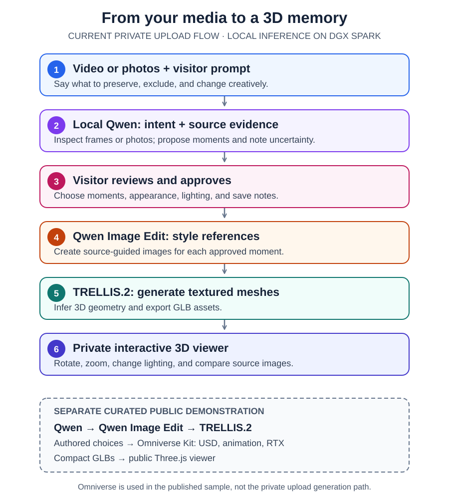

**Final project:** [https://dsgn2002.github.io/sai-kung-3d-viewer/demo/world.html](https://dsgn2002.github.io/sai-kung-3d-viewer/demo/world.html)

# My Travel Journey

Turn a travel video or a set of photos into source-guided, interactive 3D memories. This repository contains the private upload application, the reusable local-Qwen analysis skills, and the DGX Spark pipeline used to build the public Sai Kung and Hong Kong demonstrations.

[Project overview](https://dsgn2002.github.io/sai-kung-3d-viewer/) · [Create your own scene demo](https://dsgn2002.github.io/sai-kung-3d-viewer/create/) · [Explore the coast scene](https://dsgn2002.github.io/sai-kung-3d-viewer/demo/?scene=coast) · [Explore the tram scene](https://dsgn2002.github.io/sai-kung-3d-viewer/demo/?scene=city)

## What a visitor provides

The private application accepts **one MP4/MOV video** (up to 10 minutes and 500 MB) **or up to 12 JPEG/PNG/WebP/HEIC photos**. The visitor also writes what the memory should preserve, what to leave out, and any creative preference. For example:

> Keep our group together on the boat, preserve the red jacket and rocky shore, and leave out the farm scenes. Make the final memory feel like a small illustrated model at sunset.

An optional clarification can identify a person or object in the source material, such as “by *us*, I mean the person in red and the two people beside them.” The prompt expresses the visitor's priorities; it is not treated as proof that those details appear in the media. The app lets the visitor review the proposal, refine the request, and choose moments before generation.

## From source media to a 3D memory

1. **Upload and prompt.** The app stores the original video or photos privately with the visitor's highlights and optional clarification.
2. **Qwen understands and selects.** Local Qwen on DGX Spark parses the request, inspects sampled video frames or uploaded photos, and proposes up to three relevant moments. The proposal includes source images, evidence and uncertainty; video proposals also have timestamps and silent clips. Audio is not analyzed.
3. **Visitor approves.** The visitor checks the proposal against the source, chooses moments, style and lighting, and saves the selection and any notes. Approval is tied to the exact analysis revision and source hashes.
4. **Qwen Image Edit styles.** A separate local image model turns each approved reference into a miniature design.
5. **TRELLIS.2 builds geometry.** The image-to-3D model generates textured GLB meshes. Surfaces outside the camera view are inferred.
6. **Browser presents the result.** The private viewer loads the GLBs and provides rotation, zoom, lighting, and source-image comparison.

**Where Omniverse fits:** The [published Sai Kung sample](journey-demo/nature_map/README.md) uses NVIDIA Omniverse Kit **after** Qwen image styling and TRELLIS mesh creation. Our Kit script assembles the coast, traveler, and boat into an editable OpenUSD scene, animates the boat, and renders an RTX preview. A separate packaging step prepares compact GLBs for the public Three.js viewer. The sample's three memory choices, asset prompts, and scene layout were authored for that demonstration. The current [generic private upload flow](upload-app/README.md) generates individual 3D miniatures and does **not** run its output through Omniverse or publish visitor uploads to the public site.

## See the result and the evidence

- **Public project:** [My Travel Journey](https://dsgn2002.github.io/sai-kung-3d-viewer/demo/world.html) opens on a travel globe with Sai Kung boat/coast and Hong Kong tram scenes. Visitors can inspect source memories and change the scene atmosphere. The scenes are curated demonstrations, not automatically generated from an arbitrary new upload.
- **Generic workflow:** [Private upload app](upload-app/README.md) documents setup, media limits, approval, generation, and the private viewer. [Release checks](upload-app/RELEASE-CHECKS.md) record application validation.
- **Model and asset pipeline:** [Sai Kung pipeline](journey-demo/nature_map/README.md) documents local Qwen, Qwen-Image-Edit-2511, TRELLIS.2-4B, Omniverse Kit, USD, RTX, and browser packaging. The [sample-specific pipeline diagram](docs/images/sai-kung-pipeline.svg) shows that run in more detail.
- **Reusable analysis skills:** [Trip intent understanding and video evidence selection](skills/README.md) turn the prompt and source frames into a traceable evidence brief. See the [evaluation results](skills/evals/RESULTS.md).
- **Architecture and history:** [NVIDIA integration status](docs/nvidia-integration.md) and the [earlier depth-projection demo](journey-demo/README.md). The older [rocket sample](souvenir-sample/README.md) is a separate geometry prototype.

## Scope and provenance

The personal outputs are artistic interpretations of visible source material. Qwen proposes evidence and style; it does not verify identities or geography. TRELLIS infers hidden geometry, so a generated mesh is not a measured reconstruction. The current pipeline uses existing local models on DGX Spark; it does not train a new model or require a paid inference API. The earlier optional StepFun analysis belongs to the historical depth-projection demo, not the current Qwen upload path.

Original project code is [MIT licensed](LICENSE). See [third-party notices](THIRD_PARTY_NOTICES.md) for included assets and their licenses. This is a hackathon prototype, not an official NVIDIA or HKUST product.
