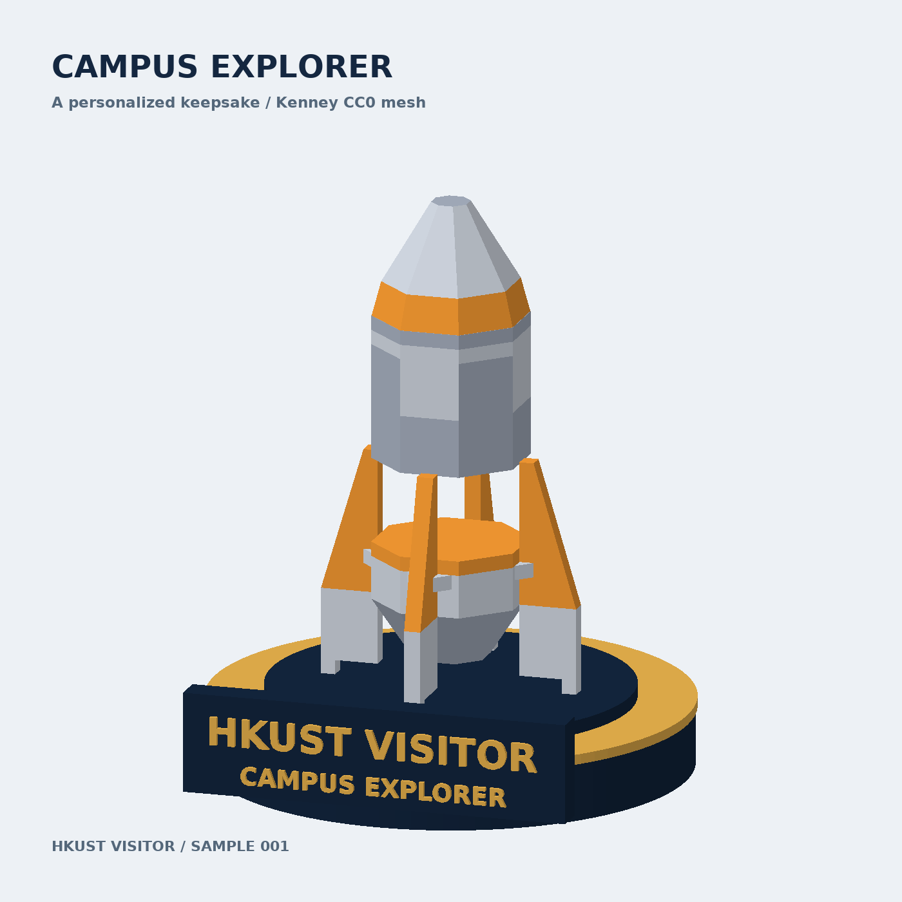

# MemGen

Turn a visitor's experience into a personalized 3D keepsake, using an agent that selects tools, creates an artifact, checks the result, and explains its decisions.

A prototype for the NVIDIA DGX Spark hackathon. Our direction is to reuse existing NVIDIA agent tooling, official skills, local model serving recipes, and freely licensed meshes.



## What works today

- A reproducible mesh customization script using three CC0 Kenney rocket modules.
- A display base and real extruded lettering with a configurable visitor name.
- GLB export, a static geometry preview, and an interactive HTML viewer.
- Export/reload validation with geometry counts and finite-coordinate checks.

The current sample is deterministic Python mesh processing. It does **not** yet perform AI inference, autonomous tool selection, or NVIDIA agent orchestration. It was built on a development Mac and copied to a DGX Spark; running it on the Spark is not yet validated. The STL is an assembly preview, not a print-ready solid.

## Run the sample

Python 3.10 or newer:

```bash
python3 -m venv .venv
source .venv/bin/activate
pip install -r souvenir-sample/requirements.txt
python souvenir-sample/build_sample.py --name "ALEX"
python souvenir-sample/make_viewer.py
python -m http.server 8080 --bind 127.0.0.1
```

Open http://localhost:8080/souvenir-sample/output/viewer.html. The viewer requires internet access for its pinned model-viewer JavaScript library. The mesh is embedded in the HTML.

Outputs are written to `souvenir-sample/output/`. GLB uses metres and Y-up; STL uses millimetres and Z-up. Each run replaces the sample outputs.

## Agent workflow being designed

1. Understand the visitor's request and optionally selected photo/video frames.
2. Choose a suitable licensed asset and personalization parameters.
3. Call the mesh customization tool with structured arguments.
4. Inspect geometry and rendered output; correct failures within a bounded retry budget.
5. Deliver the GLB with a record of tool calls, source licenses, and validation results.

The first agent demo will personalize an existing mesh. Fully generative image-to-3D is a later optional tool, subject to ARM64/GB10 compatibility and latency testing.

See [NVIDIA integration plan](docs/nvidia-integration.md) for the available tools, proposed roles, and implementation status.

## License

Original project code: [MIT](LICENSE). Included source meshes: Kenney Space Kit, CC0; see [third-party notices](THIRD_PARTY_NOTICES.md). NVIDIA tools and any future model weights retain their respective licenses. This project is not an official NVIDIA or HKUST product.
