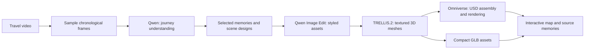

# My Travel Journey

Turn selected travel moments into an interactive digital souvenir. The latest sample creates a stylized Sai Kung nature map with generated terrain, traveler, and boat meshes. It runs on DGX Spark and supports animation, rotation, zoom, scaling, and clickable source memories. MemGen is the repository name and earlier prototype codebase.

A prototype for the NVIDIA DGX Spark hackathon. Our direction is to reuse existing NVIDIA agent tooling, official skills, local model serving recipes, and freely licensed meshes.

## Sai Kung nature map

The local pipeline is **Qwen3.6-27B video understanding → Qwen-Image-Edit-2511
styling → TRELLIS.2-4B textured meshes → Omniverse assembly and RTX rendering**.
It uses no paid inference API. The browser displays the generated meshes with
a moving boat, animated water, lighting controls, and three original memories:
the Sai Kung boat tour, High Island Reservoir, and MacLehose coastal trail.



The sample uses nine chronological frames and three fixed memory selections.
The VLM records a journey summary; scene prompts and map layout are authored
for this Sai Kung example, rather than automatically compiled from that summary.

The output contains about 350,000 triangles across three independent meshes.
Browser assets use WebP textures and Meshopt compression; editable originals
and a USD scene with textures remain available. This is an artistic map with
generated hidden surfaces and a posed traveler, not surveyed geography or a
rigged human animation.

See [sample scripts, environment, and usage](journey-demo/nature_map/README.md).
Generated assets and model weights remain on Spark; the private preview is
served through an SSH tunnel at `http://127.0.0.1:8768/`.

## Earlier depth-projection demo

The workflow starts with a human-readable **journey review**: a saved Step 5
summary, four scene suggestions with source frames and video previews, and an
explicit selection of one or more scenes. Selected scenes 1–3 show the Sai Kung
boat tour, MacLehose Trail, and Yi O harvest.

The generation pipeline uses **local MoGe-2 inference → NVIDIA Omniverse Kit →
an interactive browser viewer**. Generation makes no StepFun API calls. StepFun
was used for the earlier video understanding stage; its scripts are retained
as optional, paid analysis tools and are not invoked by reconstruction.

Each selected 1.5-second shot has 12 estimated depth frames, 32,400 vertices and
64,052 triangles. Omniverse assembles the animated geometry and source textures
into editable OpenUSD, renders RTX previews, and exports a textured still GLB
per scene. The browser plays the original movement across the estimated surfaces
and supports scene switching, pause, rotate, zoom, scale, reset and wireframe
inspection. USD/GLB reloads, animation, rendered colors and browser controls have
been checked on the actual output.

This is **animated depth projection**. It preserves the recorded appearance near
the source viewpoint. Hidden sides are not reconstructed, wide rotations can
stretch surfaces, and people are not separately rigged characters. A complete
multi-view world remains future work; see the
[reconstruction revision](docs/realistic-journey-revision.md).

See [demo setup and commands](journey-demo/README.md). Run artifacts live under
`journey-demo/runs/` and are excluded from version control; credentials remain in
the user's private configuration on the Spark.

## Earlier rocket sample

- A reproducible mesh customization script using three CC0 Kenney rocket modules.
- A display base and real extruded lettering with a configurable visitor name.
- GLB export, a static geometry preview, and an interactive HTML viewer.
- Export/reload validation with geometry counts and finite-coordinate checks.

The rocket sample uses deterministic Python mesh processing. It was built on a development Mac and copied to a DGX Spark. Its STL is an assembly preview, not a print-ready solid.

## Run the sample

Python 3.10 or newer:

```bash
python3 -m venv .venv
source .venv/bin/activate
pip install -r souvenir-sample/requirements.txt
python souvenir-sample/build_sample.py --name "ALEX"
python souvenir-sample/make_viewer.py
python -m http.server 8080 --bind 127.0.0.1
```

Open http://localhost:8080/souvenir-sample/output/viewer.html. The viewer requires internet access for its pinned model-viewer JavaScript library. The mesh is embedded in the HTML.

Outputs are written to `souvenir-sample/output/`. GLB uses metres and Y-up; STL uses millimetres and Z-up. Each run replaces the sample outputs.

## Agent workflow being designed

1. Interpret the video, summarize the journey and suggest scenes with source frames. The new map runs local Qwen; the older review reuses saved Step 5 results.
2. Let the user select one or more scenes and describe what matters. Save the selection before generation.
3. Style selected memories with local Qwen image editing, generate terrain and character meshes with TRELLIS.2, then assemble and render them in NVIDIA Omniverse. Skeletal character animation remains future work.
4. Inspect rendered views, check browser interactions, and apply bounded repairs or visitor edits.
5. Deliver a shared browser experience with GLB assets, a behavior manifest, and selected memories.

The review, local depth reconstruction, Omniverse integration and interactive
player are implemented in `journey-demo/`. The earlier primitive WorldSpec
compiler is retained as a historical prototype. General photo ingestion, visual
repair, generalized scene selection, public sharing and persistent editing remain
future work. The current preview is served from Spark through an SSH tunnel.

See [NVIDIA integration plan](docs/nvidia-integration.md) for the available tools, proposed roles, and implementation status.

See [My Travel Journey plan](docs/my-travel-journey-plan.md) for the current photo/video workflow, VLM world-design contract, Omniverse generation pipeline, interactions, and delivery milestones.

The Spark has a dedicated `travel_journey_map` Conda environment with Python 3.12
and Omniverse Kit installed. See the [pipeline demo setup](journey-demo/README.md)
for activation and the Step 5 analysis script. Actual Step 5 inference, USD
generation, GLB export, and Omniverse RTX rendering have been validated on the Spark.

## License

Original project code: [MIT](LICENSE). Included source meshes: Kenney Space Kit, CC0; see [third-party notices](THIRD_PARTY_NOTICES.md). NVIDIA tools and any future model weights retain their respective licenses. This project is not an official NVIDIA or HKUST product.
