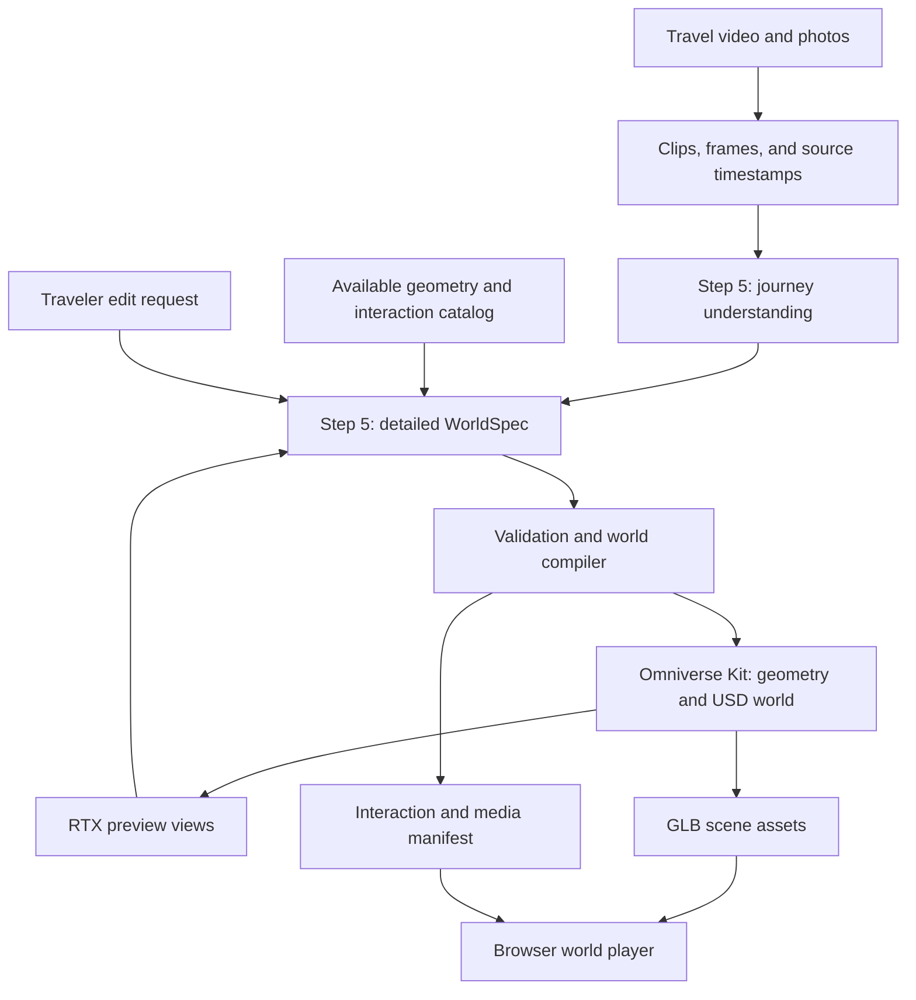

# My Travel Journey

Proposed implementation plan · updated 22 September 2026

**Demo status:** The current Spark run uses a saved Step 5 review and explicit
selection of scenes 1–3 → local MoGe-2 depth estimation → animated Omniverse USD
and RTX previews → an interactive browser viewer with rotate, zoom, scale and
recorded motion. No StepFun calls are made during this generation. Hidden sides
and separate character rigs are not reconstructed. The earlier primitive
WorldSpec demonstration is retained as history. See
[the implemented demo](../journey-demo/README.md). The broader design below,
including general photo ingestion, automated visual repair and publishing,
remains planned.

Turn travel photos, a video of approximately five minutes, or a mixture of both into a personalized, interactive 3D world that the traveler can explore and share. This is the digital souvenir: a miniature journey with recognizable places, linked memories, and a guided tour.

The product and default experience title is **My Travel Journey**. MemGen remains the existing prototype codebase. This plan supersedes the initial single-diorama proposal in `photo-to-souvenir-plan.md`.

**Core architecture:** StepFun Step 5 Preview interprets the journey and designs a detailed world specification. An application compiler validates that design against available geometry and interaction capabilities. Our NVIDIA Omniverse Kit extension generates and assembles the 3D scene. A browser player runs navigation, hotspots, media playback, and the guided journey.

The first release should use a connected miniature world with roughly 3–5 meaningful stops. This is a proposed default, not a requirement to invent stops when the input contains fewer. Free exploration means orbiting, panning, and moving between stops; a walking avatar and first-person collision system can be added later.

## 1. What the traveler experiences

1. **Upload the journey.** Add a video of about five minutes, 3–8 photos, or both. Optionally provide the destination, trip dates, and a personal caption.
2. **Review the proposed journey.** See the main stops, key memories, visual style, and suggested order. Correct uncertain place names or reorder stops when the video is a montage.
3. **Enter My Travel Journey.** Open an overview of the miniature world. A visible route connects the stops, with a starting viewpoint and a title marker.
4. **Explore memories.** Select a landmark or a stop marker to move the camera closer and open its caption, photograph, or relevant video excerpt. Use Next/Previous to follow the journey or choose Explore to move freely.
5. **Play the guided journey.** A camera tour visits the selected stops. Pause, resume, skip, or return to the overview. Media starts only after an explicit playback action.
6. **Personalize the world.** Ask for changes such as “make the harbor look like sunset,” “put the market before the hill,” or “show this clip when I select the tower.” Preview the change and allow undo.
7. **Save and share.** Publish a particular revision as a browser link. The traveler chooses which personal media accompany the world.

An illustrative journey could move through a harbor, a market street, and a hilltop viewpoint. Each becomes a small zone with its own buildings, terrain, palette, camera view, and memory. These examples describe the broader product; the implemented demonstration uses Sai Kung, Lantau, and Plover Cove/Lai Chi Wo from a hosted Hong Kong travel film.

## 2. Video and photo understanding

Step 5 Preview documents text, image, and video input, with text output, tool calls, and structured output. Its model page recommends video URLs containing MP4 files smaller than 128 MB and videos shorter than five minutes. Treat this as provider guidance, not a product limit of fewer than five minutes: the application accepts a roughly five-minute journey and prepares suitable segments. [StepFun model documentation](https://platform.stepfun.ai/docs/en/guides/models/step-5-preview)

Proposed ingestion pipeline:

- Read duration, orientation, resolution, and timebase; preserve the source file and assign stable media IDs.
- Prepare analysis copies and divide footage at useful scene boundaries, targeting 60–90 seconds per segment and staying within the provider's documented limits. Preserve overlap where useful and record exact offsets back to the original timeline.
- Have Step 5 inspect each clip for places, recurring landmarks, activities, colors, weather, time-of-day appearance, visible travel transitions, and possible memorable moments. Return timestamped observations with uncertainty and supporting frames.
- Extract representative frames for geometry references and later visual comparisons. Avoid repeatedly sampling nearly identical frames. Keep image requests within model limits.
- Merge segment observations into a journey record. Resolve repeated places across clips, retain meaningful revisits, and distinguish a new stop from a camera cut. Any segment that fails remains visibly incomplete rather than disappearing silently.
- Use video order as the default narrative order. An edited montage does not establish actual travel chronology or GPS coordinates. Allow the traveler to correct order and labels. For photo-only input, propose an order and make it editable.
- Preserve source audio with selected playback clips. If spoken narration is needed for analysis, add a separate timestamped transcription step; do not assume the VLM's video support includes audio understanding.

The VLM works in two passes: **observe the journey**, then **design a world from that evidence**. A low-resolution overview may help with continuity, but it does not replace analysis of the source segments. Application code maps local clip timestamps back to the original video and validates every media reference.

## 3. Step 5's output: a buildable WorldSpec

Step 5 is responsible for the world design, including interactions. Its output is structured data. The application must provide a catalog of supported geometry templates, assets, materials, animations, and interaction types so that the design can be executed.

| WorldSpec section | Details the VLM must specify | How the application uses it |
| --- | --- | --- |
| World identity | Title, description, visual style, coordinate convention, overall bounds | Configure the project and initial view |
| Journey stops | Stable IDs, labels, narrative order, source timestamps/photo IDs, confidence | Create zones and an editable journey timeline |
| Spatial layout | Zone positions and sizes, terrain, paths, adjacency, clearances | Generate a coherent miniature world |
| Objects | IDs, parent zone, generation method, template or asset ID, parameters, dimensions, transforms | Create or import actual mesh geometry |
| Appearance | Material IDs, palette, texture references, lighting presets | Style the USD scene and portable browser materials |
| Cameras | Overview pose, stop viewpoints, targets, transition durations, travel waypoints | Implement exploration and guided navigation |
| Interactions | Trigger, target object, allowed action, media/memory reference, destination stop | Bind clicks, buttons, and tour controls |
| Animation | Supported clip/preset ID, target object, loop and duration | Play supported movement in the scene/player |
| Memories | Caption, source media ID, source time range, selected share visibility | Present a photo or bounded video excerpt |
| Construction notes | Observed versus approximated geometry, unresolved assets, priorities, complexity budget | Validate feasibility and decide what needs attention |

Names such as `WorldSpec`, `create_world`, and `move_to_stop` are application contracts we will implement; they are not built-in StepFun or Omniverse capabilities.

Example of one proposed stop, abbreviated to illustrate the contract:

```json
{
  "id": "harbor_stop",
  "label": "Harbor",
  "source": {"media_id": "journey_video", "start_s": 20, "end_s": 65},
  "layout_position_m": [0, 0, 0],
  "objects": [
    {
      "id": "harbor_tower",
      "generation_method": "procedural",
      "template_id": "tapered_tower_v1",
      "parameters": {"height_m": 4, "base_width_m": 1.2},
      "material_id": "warm_stone",
      "geometry_basis": "stylized_approximation"
    }
  ],
  "camera": {"position_m": [8, 6, 8], "look_at_m": [0, 2, 0]},
  "interactions": [
    {
      "trigger": "select",
      "target_id": "harbor_tower",
      "action": "open_memory",
      "memory_id": "harbor_memory"
    }
  ]
}
```

These values are illustrative, not model output from a real upload. A full specification must resolve every material, memory, template, and object reference. Layout dimensions describe the designed miniature's virtual space; they are not measured landmark dimensions.

Use metres and Y-up across the scene pipeline. Stable world, zone, object, camera, and memory IDs connect the design to USD paths and exported GLB nodes. Keep source observations separate from creative choices so changing the style does not rewrite what happened on the trip.

## 4. Generation, rendering, and interaction



The compiler checks the WorldSpec and creates two coordinated outputs: instructions for the Omniverse builder, and a behavior manifest for the browser player. Both belong to the same revision.

**Omniverse builder.** Implement a custom Kit extension in Python. It creates terrain, paths, structures, lettering, scene objects, materials, lights, and cameras in an OpenUSD stage. Geometry comes from procedural templates or suitable licensed meshes. The VLM chooses and parameterizes these tools. An optional image-to-3D adapter can later supply unusual landmark meshes; it requires separate model selection and hardware validation. A descriptive prompt alone does not define executable geometry. [NVIDIA Kit architecture](https://docs.omniverse.nvidia.com/kit/docs/kit-manual/latest/guide/kit_architecture.html)

**Preview and review.** Render the overview and representative views of each stop with Omniverse RTX. Step 5 compares the results against the world design and reference frames, then proposes bounded repairs. Keep at most two automatic repair rounds and preserve the last valid revision. Unsupported geometry remains a visible unresolved design item or an explicit stylized approximation.

**Interactive browser player.** Use a Three.js application for the world experience. Its responsibilities include selecting objects, moving cameras, navigating stops, running the guided tour, playing animations, and displaying media panels. Load the exported scene and bind application actions using the stable object IDs. Three.js documents the corresponding loading, picking, animation, and camera-control primitives. [Three.js documentation](https://threejs.org/docs/)

The existing model-viewer page remains useful for inspecting individual exported meshes. The shared world needs its own application behavior: a GLB can carry geometry and supported animations, while our manifest/player implements captions, source-video links, route progression, and controls. Verify behavior in the browser; a correct Omniverse render alone cannot prove that a hotspot or tour works.

For the first version, support these interaction types: focus on a stop, open a memory, play/pause a selected excerpt, move to the next/previous stop, play/pause the tour, and return to overview. Make every clickable stop accessible through an equivalent labeled button. Respect reduced-motion preferences and provide a static preview if 3D rendering fails.

## 5. Editing and consistency

Store an immutable WorldSpec and output manifest for each revision. A typed patch names its base revision and affected IDs. Supported edit operations include changing geometry parameters, materials, lighting, zone layout, stop order, cameras, captions, and memory bindings.

Before a build, validate schema, IDs, template availability, dimensions, material references, media ranges, route connectivity, and allowed interaction actions. When a stop moves, update its object transforms, camera targets, hotspots, and route waypoints together. When a stop is removed, repair incoming navigation links and tour order.

Application tools should include `inspect_journey_segment`, `list_world_capabilities`, `create_world`, `apply_world_patch`, `render_world_views`, `validate_world`, and `package_journey`. These are proposed typed tools, with bounded parameters. Execute predefined operations instead of arbitrary code returned by the VLM.

Record the requested change, relevant observations, model identifier, tool calls, revision, and validation result. Isolate project outputs. Do not overwrite the existing rocket sample or another traveler's world.

## 6. Deliverable, hosting, and performance

The primary deliverable is a versioned interactive web experience titled **My Travel Journey**. Its package contains:

- One or more GLB scene assets with stable object identifiers and portable materials.
- A validated runtime manifest containing stop order, cameras, hotspot actions, and media bindings.
- A cover image and selected memory thumbnails/clips.
- The browser player and a share URL pointing to a saved revision.
- The editable USD scene, WorldSpec, provenance, and validation report retained with the project.

Sharing publishes only the chosen memories. Original uploads stay private by default, and the app explains that analysis copies go to StepFun. For a shared video memory, create a trimmed derivative of the selected excerpt rather than exposing the full original through a player timestamp. Update source-to-derivative time mappings accordingly. Serve media on demand so loading the world does not download the entire journey video.

Use portable PBR material properties for USD-to-GLB export and compare the browser result with RTX previews. Shader-specific effects need a browser equivalent or a baked approximation. Native Omniverse simulation behaviors require an explicit browser implementation or baked animation.

Start with a compact world of roughly 3–5 stops and a provisional 20 MB initial scene budget excluding streamed clips. Aim for smooth interaction on a named test phone. Measure preprocessing, each VLM pass, geometry generation, rendering, export, first load, and repair attempts separately. Benchmark a five-minute upload before promising a total generation time; the original single-diorama latency target is superseded.

Use the hosted Step 5 API and keep its credentials on the backend. Test Omniverse on the available DGX Spark with the actual driver, Kit build, and required extensions. NVIDIA documents ARM support and Spark fixes in Kit release notes, but this application's runtime still needs validation. If a required component fails, run the same Omniverse worker on a supported RTX host. [NVIDIA platform notes](https://docs.omniverse.nvidia.com/dev-guide/latest/release-notes/109_0_1_highlights.html)

## 7. Build sequence and acceptance

| Milestone | Concrete result | Acceptance check |
| --- | --- | --- |
| 1. Prove the full handoff | A short clip becomes a WorldSpec, an Omniverse scene, and one clickable browser memory | Object IDs, geometry, and media timestamps agree end to end |
| 2. Understand a full journey | Process an approximately five-minute video and optional photos into timestamped stops | Cover every segment, merge repeats, expose uncertainty, and allow order corrections |
| 3. Build the interactive world | Generate supported geometry for several stops, a connecting route, viewpoints, and hotspots | Every stop is reachable; every action and media reference resolves |
| 4. Add editing and the guided tour | Change a stop's appearance or position, reorder stops, and play/pause a tour | All dependent cameras, routes, and bindings update; undo restores the previous revision |
| 5. Deliver a shareable keepsake | Package the browser experience and selected media under the final title | A second device opens the saved revision, navigates all stops, and plays the intended excerpts |

Evaluate photo-only input, a continuous journey video, a rapid montage, repeated visits, a low-quality segment, an input near five minutes, and an input whose size requires splitting. Check unsupported landmark requests and missing asset cases. Review multiple camera angles and test the actual browser actions, tour transitions, and exported node mapping. Track token usage and generation latency against the number of stops and source duration.

## 8. Repository changes when implementation starts

Reuse geometry, lettering, and GLB validation ideas from `souvenir-sample/build_sample.py`. Retain the existing rocket output as the current working sample. Add media preprocessing, timestamped journey observations, WorldSpec schemas, a capability catalog, a StepFun adapter, the Omniverse extension, a world exporter, and an interactive web player.

The initial travel video, reviewed scene selection, local depth reconstruction,
Omniverse assembly and browser controls have been demonstrated on Spark. This
document also describes a broader product that has not been implemented: full
scene reconstruction, separately generated people, conversational edits and a
hosted share page. Further StepFun analysis requires explicit authorization for
paid API use; it is not needed to reconstruct an already selected scene.
