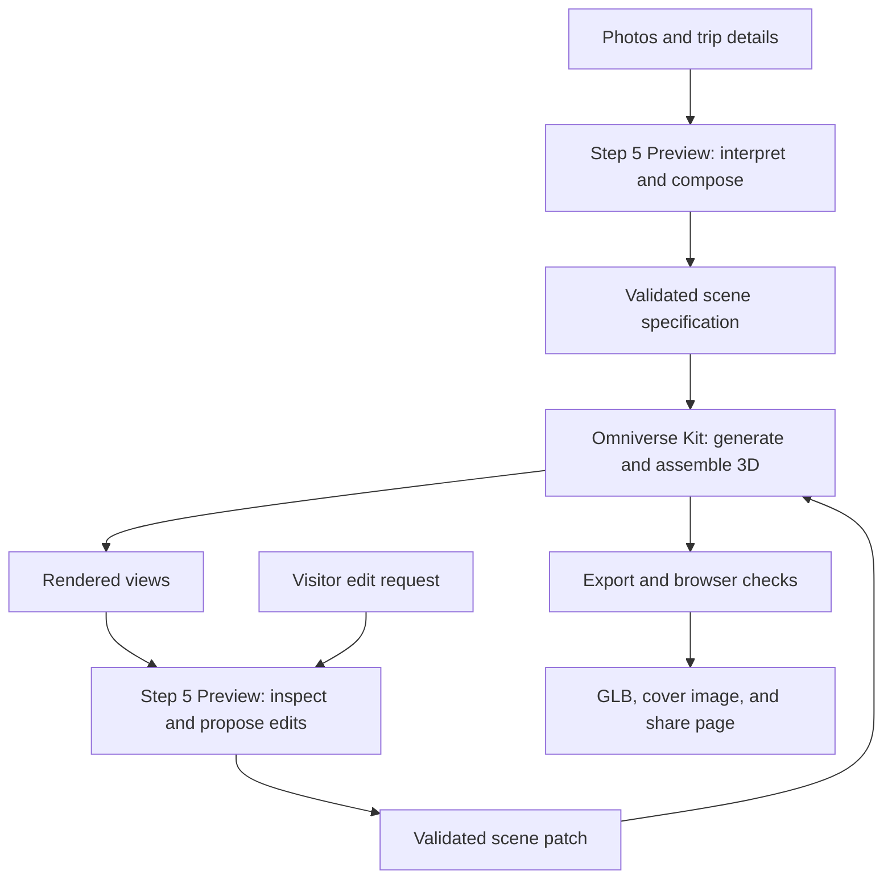

# Original photo-to-souvenir proposal

**Superseded:** The current design is [My Travel Journey](my-travel-journey-plan.md), which accepts photos and an approximately five-minute travel video and creates an interactive 3D world. This document preserves the initial single-diorama proposal.

Proposed implementation plan · 22 September 2026

Turn 3–8 visitor photos of a city or tourist destination into a small, recognizable 3D diorama. The visitor can rotate it, request visual changes in ordinary language, add a trip title or personal message, and share it through a browser link. The selected output is a digital keepsake.

**Core decision:** StepFun `step-5-preview` interprets the photos, designs the composition, and directs visual edits through application tools. A custom NVIDIA Omniverse Kit extension generates and edits the geometry, assembles the OpenUSD scene, and renders it. The product is a stylized interpretation of the trip; different scenic photos are composition references rather than measurements of one continuous space.

StepFun documents image input, text output, tool calling, and structured output. Visual editing therefore means that the model requests changes to the scene and inspects rendered results. The application supplies the editing tools. A separate image-generation model is unnecessary for this first version. [StepFun model documentation](https://platform.stepfun.ai/docs/en/guides/models/step-5-preview)

Omniverse provides OpenUSD composition and RTX rendering. Our extension supplies the photo-to-scene logic and procedural modeling; there is no assumed one-call photo-to-mesh feature. [NVIDIA USD Composer overview](https://www.nvidia.com/en-us/omniverse/apps/create.md/)

## 1. The souvenir and visitor experience

Default art direction: a miniature destination on a rounded display base, with one prominent landmark, up to two supporting features, simplified terrain, a palette drawn from the photos, and a readable trip inscription. Start with a matte ceramic appearance and warm lighting. Support a second postcard-like color treatment once the first route works.

The visitor flow is:

1. **Add memories.** Upload 3–8 photos; enter the destination, optional trip date, and optional inscription. Choose the most meaningful photo. Use explicit visitor text for names and dates.
2. **Choose the composition.** Show one draft and a short explanation of the selected features. Allow the visitor to correct landmark labels and choose what belongs in the souvenir. Multiple views of the same landmark should become one object.
3. **Explore the first model.** Present an interactive 3D preview with rotate, zoom, and reset-view controls. Keep the original photos accessible beside it.
4. **Edit visually.** Requests such as “make the tower taller,” “use the sunset colors,” “move the mountain behind the buildings,” or “change the inscription” produce a new scene revision. Offer undo and a before/after comparison.
5. **Save and share.** Provide a read-only browser link, a downloadable GLB, and a cover image. Keep the editable USD package with the project. Each shared result identifies a particular saved revision.

For a waterfront example, the model could combine the skyline silhouette from one photo, water colors from another, and a hill from a third. Their arrangement serves the souvenir composition; it does not imply those views share an exact geographic layout.

## 2. Pipeline and responsibilities

| Component | Responsibility | Result |
| --- | --- | --- |
| Upload and project service | Normalize orientation and image size; assign photo IDs; save visitor choices | Photo set and project record |
| Step 5 Preview API | Extract visible features and palette; group duplicate landmarks; propose composition and edits | Structured observations, scene specification, scene patches |
| Python orchestration service | Validate model outputs; run a bounded tool loop; manage jobs and revisions | Reliable execution and trace |
| Omniverse Kit extension | Build meshes, place assets, apply materials, create lettering, set cameras and lighting | Editable USD stage and rendered previews |
| Export worker | Extract the supported mesh/material subset from the final stage and package it for the browser | GLB, poster image, validation report |
| Web viewer and sharing service | Display the model, collect edits, serve saved artifacts | Interactive keepsake and share URL |

Use Step 5 through its hosted API for the first implementation. Keep credentials on the backend. Run the Omniverse worker on DGX Spark after verifying the chosen Kit build, driver, extensions, and export path on that machine. The development Mac can host the UI and orchestration during development.

NVIDIA's Kit 109.0.1 release notes document ARM support and DGX Spark rendering fixes, alongside extension limitations. This establishes a candidate path, not validation of our installation. Select and pin a currently supported build after a local smoke test; if a required component fails, use a supported RTX host for the same Omniverse worker. [NVIDIA Kit platform notes](https://docs.omniverse.nvidia.com/dev-guide/latest/release-notes/109_0_1_highlights.html)

## 3. How photographs become actual geometry

The first version should support one selected destination and a small catalog of landmark shapes. Add destinations by adding templates or licensed assets. This provides a measurable first release without promising arbitrary landmark reconstruction.

For each proposed scene object, Step 5 records the source photo IDs, visible defining features, relative proportions, and uncertain details. The builder then selects one of these routes:

- **Procedural geometry:** parameterized towers, buildings, arches, bridges, hills, trees, water surfaces, bases, and extruded lettering.
- **Curated landmark mesh:** a recognizable licensed asset, placed and styled to match the photos. Keep its source and redistribution terms with the project.
- **Simplified interpretation:** a mesh or extruded silhouette for a feature that the available geometry cannot represent closely. Show the approximation in the draft description; an optional photo crop can become a small keepsake plaque.

Provide real volume and sensible rear surfaces so the result can be rotated. Unseen geometry is a design approximation. Do not present generated rear views as observed evidence or treat unrelated photos as calibrated multi-view captures.

Omniverse constructs the final composition from these elements and owns the editable USD stage. If later versions need detailed geometry for arbitrary landmarks, evaluate a separate image-to-mesh component and import its output into this same stage. That is a distinct extension to the first release.

## 4. The visual editing contract

Use stable object IDs and a versioned `SceneSpec`. It contains the selected photo references, landmark/template IDs, transforms, material parameters, lighting preset, camera, inscription, and approximation notes. Standardize units and axis conventions explicitly; use metres and Y-up for the shared geometry path.

Step 5 interacts with a small tool surface:

| Tool | Purpose |
| --- | --- |
| `list_scene_assets` | Return available templates, parameter bounds, and asset metadata |
| `build_scene` | Build an initial stage from a validated specification |
| `apply_scene_patch` | Apply allowed changes against a specific scene revision |
| `render_scene_views` | Render front, three-quarter, rear, and detail views as needed |
| `validate_scene` | Check required objects, geometry, references, and export constraints |
| `export_keepsake` | Package a validated scene revision and its cover image |

An edit becomes a typed operation such as `set_material`, `set_transform`, `set_light_preset`, `set_inscription`, or `set_visibility`. The operation names are proposed application contracts, not native StepFun APIs. The backend validates object IDs, parameter ranges, scene revision, and asset references before execution. Scene editing uses these operations rather than executing free-form model-generated Python.

After an edit, render the affected view and at least one alternate angle. Step 5 checks whether the visible result matches the request. Deterministic checks cover geometry and the exact inscription string. Permit at most two automatic repair attempts; retain the last valid version if a repair fails. Keep the visitor's selected landmarks stable unless their request changes the selection.

A revision records the request, patch, source scene revision, model identifier, and validation result. Save each project under its own output directory so requests do not overwrite the current souvenir sample.

## 5. Digital delivery and quality

The deliverable is a mesh-based GLB served in the browser, plus an editable OpenUSD package and a cover image. Reuse the existing model-viewer experience for the first release. The editor can use rendered previews during expensive work, then refresh the GLB when the new revision is ready.

Limit the initial material system to portable base color, roughness, metallic, and simple emissive/texture properties. Preserve these when exporting evaluated meshes and transforms from USD to GLB. Omniverse lighting and browser lighting will differ; compare both views and tune a matching browser environment. Validate export early instead of assuming every Omniverse material will transfer automatically.

Initial engineering targets, to be measured on the chosen devices:

- A complete first souvenir within 3 minutes for supported scenes; appearance-only edits within 15 seconds with a warm worker.
- A GLB below 20 MB, at most 150,000 triangles, and textures no larger than 2K unless visual review justifies an exception.
- Smooth orbit interaction on a named test phone; aim for at least 30 FPS during the demo.
- All selected landmarks present; readable inscription; no floating objects, broken references, invalid coordinates, or visible missing faces.
- A fresh browser session can open the saved link and load the intended revision with its materials and caption intact.

Evaluate with one well-covered landmark, different landmarks from the same destination, repeated views of one landmark, ambiguous/low-quality photos, and a requested edit. Check every final model from multiple angles. Record end-to-end latency, StepFun token usage, render/export time, and repair count. Treat these targets as acceptance goals, not measured performance claims.

Sharing uses a hosted read-only viewer and versioned artifact storage; a local file path is not a share link. Publish the result when the visitor chooses Share. Keep source photos in the private project unless the visitor elects to include a memory gallery. The application should explain that its selected photos are sent to StepFun for analysis. Shared pages need only the finished artifact and chosen caption.

## 6. Build sequence and completion gates

| Milestone | Work | Completion gate |
| --- | --- | --- |
| 1. Prove the integration | Confirm Step 5 API access; analyze a sample image; launch Kit on the target host; generate a primitive scene; render and export it | One natural-language color change updates the Omniverse scene and appears in the browser GLB |
| 2. Build one destination | Select the first actual photo set; implement its landmark templates, terrain, base, inscription, and scene schema | 3–8 photos produce a recognizable diorama with real geometry and traceable photo references |
| 3. Add the edit loop | Connect image-based inspection, typed scene patches, revision history, and undo | Color, scale, placement, and inscription edits work; an unsupported request leaves the last valid model available |
| 4. Deliver and share | Add the project UI, export checks, cover image, artifact hosting, and read-only share view | A second device opens the saved souvenir and rotates it successfully |
| 5. Validate the demo | Run the input/edit cases; measure performance; tune the art direction and browser appearance | A repeatable photos → first scene → edit → share demonstration meets the agreed quality bar |

The first implementation work should be milestone 1. It resolves the highest uncertainties—model access, Omniverse execution, and export fidelity—before investing in a broad asset library or UI.

## 7. Reuse from the current repository

The current sample already demonstrates personalized mesh assembly, a display base, extruded lettering, GLB output, and a browser viewer. Its scripts are a useful starting point for geometry helpers and delivery. They do not yet integrate Step 5 or Omniverse, and the current validation only covers basic export/geometry properties.

Refactor reusable helpers out of `souvenir-sample/build_sample.py`, preserving the existing rocket example as a reference. Adapt `souvenir-sample/make_viewer.py` into a viewer that loads the saved project artifact. Add a separate application path for the photo workflow, typed scene contracts, StepFun adapter, Omniverse extension, and per-project storage.

The inputs needed when implementation starts are the first photo set, destination and preferred inscription, backend access to StepFun, access to the Omniverse host, and a hosting destination for real share links. The design above is complete without those inputs; live integration and visual fidelity remain to be demonstrated.
