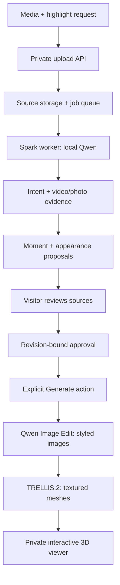

# Personal upload → reviewed evidence → 3D memory

This application connects the two local-Qwen skills to a private
browser workflow. It accepts a user's media and highlights, runs asynchronous
analysis on Spark, suggests evidence and appearance options, and saves an explicit
approval. A separate explicit Generate action runs local Qwen image styling and
TRELLIS.2 meshes, then opens an interactive private viewer. The public coast and
city demonstrations remain separate. Uploaded media is not published.



The worker runs the model stages from locally stored checkpoints. The two
reusable skills own intent and evidence behavior; `trip_upload/pipeline.py`
adapts photos and creates the application's proposal wrapper. The API owns
uploads, access control, queueing, and approval. The same exclusive GPU worker
consumes generation jobs after checking the saved revision, proposal hash and
source hashes. Analysis and generation cannot overlap in that worker.

## Run locally or on Spark

Use Python 3.10+ and install `requirements.txt` into a separate application venv.
FFmpeg and FFprobe must be available. Keep the existing CUDA model environment;
the API does not need Torch and must not replace its CUDA packages.

```bash
python3 -m venv /path/to/upload-venv
/path/to/upload-venv/bin/pip install -r upload-app/requirements.txt

export TRIP_DATA=/path/to/private-upload-data
export MEMGEN_QWEN_MODEL=/path/to/existing/qwen-checkpoint
export TRIP_WORKER_PYTHON=/path/to/existing/cuda-env/bin/python
# Local HTTP only. Leave the default 1 for the HTTPS demo.
export TRIP_COOKIE_SECURE=0

/path/to/upload-venv/bin/python upload-app/manage.py preflight
/path/to/upload-venv/bin/python upload-app/manage.py invite --name 'Teammate'
/path/to/upload-venv/bin/python upload-app/manage.py serve --port 8890
# Separate terminal, same environment:
/path/to/upload-venv/bin/python upload-app/manage.py worker
```

Open `http://127.0.0.1:8890/` and enter the invitation code. Each invitation owns
a separate workspace. Codes are high-entropy credentials: share them privately,
not in the public site or repository. The service stores hashes of invitation
and session tokens, checks CSRF tokens on writes, and checks project ownership
for media and evidence access. Sessions last 24 hours; invitations default to
30 days. Login failures are rate-limited.
The application preflight checks the HEIC decoder in the API environment and
delegates CUDA/model checks to `TRIP_WORKER_PYTHON`, keeping those environments separate.

For the invited demo, run an official `cloudflared tunnel --url
http://127.0.0.1:8890 --no-autoupdate` with `TRIP_COOKIE_SECURE=1` for the API.
The temporary HTTPS hostname may change on tunnel restart. No custom domain or
Vercel account is needed. Keep the service bound to loopback. No CORS wildcard
or cross-site cookies are used: the application and API have the same origin.
The tunnel provider carries authenticated traffic and uploaded media; inference
stays on Spark. Enable this exposure only with the operator's approval.

If the tunnel client runs on a development Mac, forward the Spark loopback port
first with `ssh -fNT -o ExitOnForwardFailure=yes -o ServerAliveInterval=30 -o ServerAliveCountMax=3
-L 8892:127.0.0.1:8890 dgx-spark`, then point the tunnel to
`http://127.0.0.1:8892`. In that arrangement the Mac, SSH connection, and tunnel
must all remain running. The Spark worker continues queued analysis if the
gateway disconnects, but browsers cannot reach it until the gateway returns.
The `-fNT` options keep the SSH forward running in the background after its
launching terminal exits. If localhost refuses the connection after a restart
or network interruption, rerun the forwarding command; do not restart a healthy
Spark API or worker just to restore the local connection.

### Keep the Spark processes running

On a host with a user systemd manager, start the API and worker independently.
Use your own absolute source, venv, data, and model paths below. Do not start a
second worker for the same data directory.

```bash
systemd-run --user --unit=memgen-upload-api --property=Restart=on-failure \
  --working-directory=/path/to/repository \
  --setenv=TRIP_DATA=/path/to/private-upload-data \
  --setenv=MEMGEN_QWEN_MODEL=/path/to/existing/qwen-checkpoint \
  --setenv=TRIP_COOKIE_SECURE=1 \
  /path/to/upload-venv/bin/python upload-app/manage.py serve --port 8890

systemd-run --user --unit=memgen-upload-worker --property=Restart=on-failure \
  --working-directory=/path/to/repository \
  --setenv=TRIP_DATA=/path/to/private-upload-data \
  --setenv=TRIP_WORKER_PYTHON=/path/to/existing/cuda-env/bin/python \
  /path/to/upload-venv/bin/python upload-app/manage.py worker

systemctl --user status memgen-upload-api memgen-upload-worker
journalctl --user -u memgen-upload-api -u memgen-upload-worker
```

These are transient services; recreate them after a host reboot. Inspect private
job logs under `$TRIP_DATA/projects/<id>/logs/` for inference errors. Stop active
jobs through the UI before planned worker maintenance. Refresh invitation codes
with `manage.py invite`; use one invitation per tester to separate workspaces.

## Inputs and behavior

- One MP4/MOV video, ≤10 minutes, ≤500 MB, ≤4096 pixels per dimension; or up to
  twelve still JPEG/PNG/WebP/HEIC photos, ≤20 MB each and ≤50 million pixels.
- Browser uploads start with 128 KiB chunks and adapt between 32 KiB and 1 MiB
  to the measured acknowledgement time. The API still accepts chunks up to 8 MiB
  for compatibility. Progress shows bytes confirmed by Spark, measured speed,
  estimated remaining time, and the separate media-validation phase. A stalled
  chunk times out after 45 seconds; up to two reconnect attempts verify the
  saved part hashes and resume at the server's committed offset.
  Idempotent retries compare existing bytes.
  To resume after a reload, choose the same file again; the browser verifies all
  previously accepted chunk hashes before sending the remaining bytes.
- Decode actual media bytes, retain original SHA-256, normalize photo orientation,
  and create previews. HEIC decoding uses Pillow-HEIF. Photos have no invented
  timestamps or video clips; their normalized-image hashes link to original hashes.
- Media becomes immutable when analysis is queued. Revise the highlight request
  or clarification and analyze again to create a new revision. Use a new project
  to change source media.
- Video uses the existing evidence skill with 96 coarse + 24 refinement frames;
  photos are all assessed. Batches default to three images. Override only through
  `TRIP_COARSE_BUDGET`, `TRIP_REFINEMENT_BUDGET`, `TRIP_BATCH_SIZE` on the API; each
  job snapshots those settings. Production defaults favor quality, not low latency.
- Local Qwen proposes natural, cinematic, or illustrated appearance, with day,
  sunset, or night lighting. These are recommendations, not generated previews.
- A final source check and the existing place/identity guards keep uncertainty
  visible. Model descriptions can still be wrong and need source review.
- Users select moments and save appearance, lighting, and notes. Approval binds
  the exact job, revision, and proposal checksum. It never marks generation started
  or independently verifies geographic/identity claims.

## Worker, durability, and retention

SQLite WAL stores projects, uploads, sessions, jobs, and approvals. The worker
holds an exclusive process lock; its model subprocess inherits the lock so an
orphaned subprocess cannot overlap a new worker. Jobs execute one at a time and
models are loaded only in that subprocess. Cancellation terminates only that
owned process group. API requests remain responsive during inference.

Stage and frame-batch progress are persisted. The default per-stage timeout is
two hours. Worker interruption marks unfinished jobs failed at recovery; retry
creates a fresh run and retains prior diagnostics. This milestone does not reuse
partial model stages silently. A failed styling suggestion does not erase the
already-written evidence artifacts, but the UI requires a completed proposal.

There are at most two active jobs per invitation, eight globally, and ten
projects per invitation. Delete active projects after cancelling their analysis.
The worker removes inactive non-running projects after seven days, checking
hourly between jobs. Operators can also run `manage.py cleanup`. This retention
depends on the worker or cleanup command running; the static site performs none.

Private artifacts live in `$TRIP_DATA/projects/<project>/jobs/<job>/`:
`intent/`, unchanged video `evidence-brief.json` and `catalog.json` when applicable,
photo evidence traces, `proposal.json`, contact sheet, source assets, and `review.md`.
Logs stay outside the HTTP artifact allowlist. Source media is never added to Git.

## HTTP contract

- `POST /api/login`, `GET /api/session`, `POST /api/logout`.
- `GET/POST /api/projects`, `GET/DELETE /api/projects/{id}`.
- `POST /api/projects/{id}/uploads`, `PUT .../uploads/{upload}?offset=<bytes>`,
  `POST .../uploads/{upload}/complete`, `DELETE .../uploads/{upload}`.
- `POST .../analyze` with request/context; `POST .../cancel`.
- `GET .../proposal`, owner-scoped preview and allowlisted artifact URLs.
- `POST .../approve` with job ID, revision, proposal hash, selected moment IDs,
  style, lighting, and notes. Response reports generation availability on this host.
- `POST .../generate`, `POST .../generations/{generation}/cancel`.
- `GET .../generations/{generation}/result` and `.../assets/{name}` are owner-scoped.

`proposal.json` is a versioned `media_evidence` wrapper, separate from the existing
video skill contract. It includes source IDs/hashes, unchanged intent requirements,
moments and references, conservative requirement status, model provenance, and
style suggestions. Photo timestamps and clips are null. A photo collection is not
assumed to be a sequence of views of the same object.

## Verification

```bash
/path/to/upload-venv/bin/python -m unittest discover -s upload-app/tests -v
/path/to/upload-venv/bin/python -m unittest discover -s skills/tests -v
```

HTTP/media tests decode real images/video and use an explicit local test double
for model calls. The production API/worker has no mock-model switch. The browser
fixture test is `tests/browser_check.cjs`; it runs against an isolated local
workspace and labels its synthetic model output. Live Spark executions must be
reported separately in `RELEASE-CHECKS.md`.


## Local generation and viewer

Set `TRIP_GENERATION_ROOT` to the existing Spark installation (default
`/home/Developer/travel_journey_map`). Generation requires its Qwen-Image-Edit-2511,
TRELLIS.2, DINOv3, sparse decoder, compiled CUDA extensions and gltfpack, described
in [the existing generation runtime](../journey-demo/nature_map/README.md). Keep
`journey-demo/nature_map/{style_assets,generate_meshes,package_assets}.py` alongside
this application. The API preflight covers analysis; generation availability
checks required local files, while detailed generation failures retain a private log.

Save selected moments and a style, then press **Generate 3D memory**. The worker
snapshots approval, verifies original/reference hashes, styles each selected hero
image on white, generates a textured mesh, and packages it for the browser.
The lighting choice is rendered interactively. Free-text approval notes are
retained for provenance but are not interpreted as geometry edits in this version.
Outputs are separate source-guided miniatures; they do not establish faithful
reconstruction, human likeness, rigged animation, geographic placement or an
Omniverse scene export. The static published sample is not overwritten.

Generation writes `generations/<id>/result.json`, stage timing, prompts, model
records and outputs. It records queue time, generation wall time, summed analysis
attempt time, and first-analysis-to-generation wall time including failures, fixes
and review wait. It never presents a recovered run as a fresh benchmark.

The viewer bundle is committed so the runtime needs no npm install or CDN.
To rebuild after editing `web/generation-viewer.js`:

```bash
cd upload-app/viewer-build
npm ci
npm run build
```

Three.js and Meshopt decoder license notices are in `web/THIRD-PARTY-LICENSES.txt`.
Generated assets, database, invitations, source uploads and logs must stay outside
Git. The `/static/generation.html` page permits WebAssembly for Meshopt decoding;
all scripts and assets are otherwise served from this application origin.

### Curated scene refinements

A generated scene may have a separate `presentation.json` beside `result.json`.
This is an explicit, curated presentation edit; it does not change the source
brief, saved approval, original mesh, generation output, or inference timings.
The API binds each edit to the asset ID and both its source and mesh SHA-256.
Unsupported presets or mismatched hashes are rejected.

Version 1 supports `dining-characters-v1` (a modular cafe with generic animated
male/female adults) and `lantern-display-v1` (separate round/fish lanterns with
subtle sway). The current uploaded demo uses these edits following user feedback.
The viewer offers the original generated mesh for comparison and download, plus
an animation toggle; reduced-motion preferences default to paused animation.
The scene assembly and character placement are manually designed. This is not
automatic scene segmentation or replacement for arbitrary uploaded footage.
Generic character assets and their CC0 provenance are in `web/characters/`.

Manifest shape (hashes must match the real result):

```json
{"version":1,"assets":[{"id":"moment-01","source_sha256":"…","mesh_sha256":"…","preset":"dining-characters-v1"}]}
```
